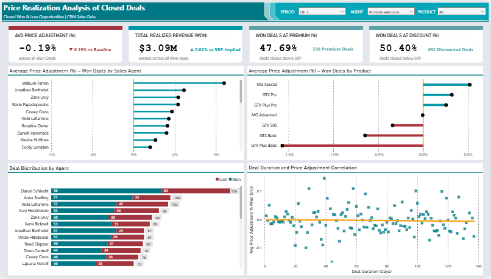
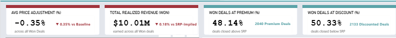
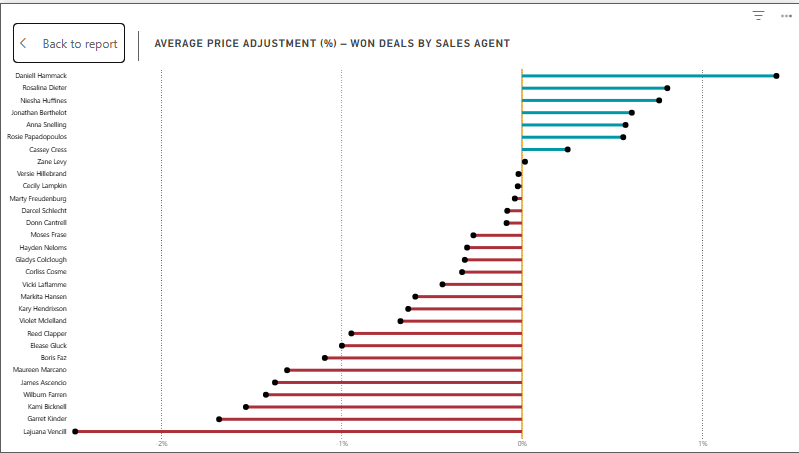
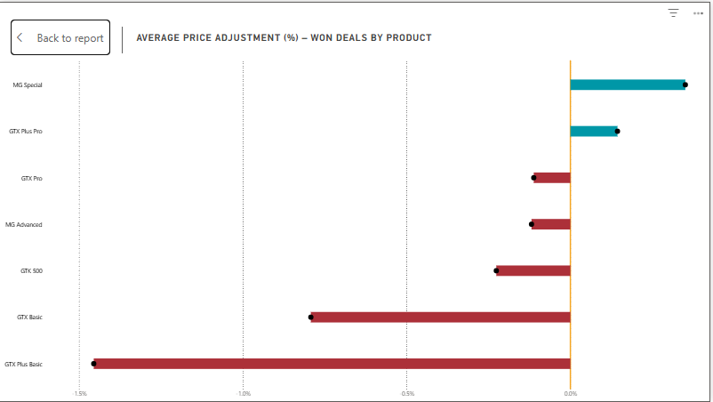
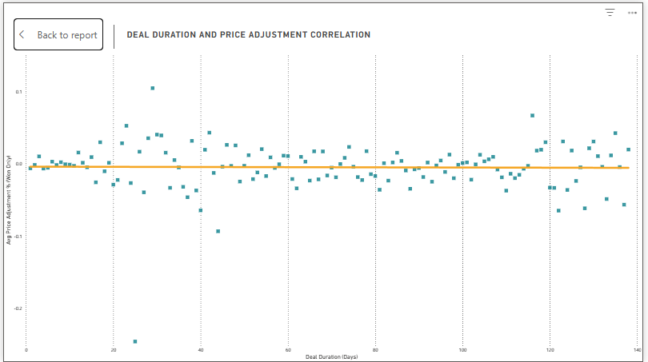

# Price Realization Analysis of Closed Deals Using CRM Sales Data

*This project evaluates pricing discipline by comparing actual won opportunity closed value against suggested retail pricing (SRP). The analysis examines pricing performance across sales representatives, products, and deal duration to identify key drivers of discounting and premium pricing.*

**Prepared by:** Gio Noga  

**Dataset Source:** [CRM🚀 + Sales📊 + Opportunities🔖](https://www.kaggle.com/datasets/innocentmfa/crm-sales-opportunities)

---

## 1. Objective

### 1.1 Business Problem

Sales leadership currently has limited visibility into how actual won opportunity prices compare to suggested retail pricing. This gap makes it difficult to assess pricing discipline, identify margin leakage, and understand where discounting or premium pricing behaviors occur.

This analysis focuses exclusively on **closed opportunities** to ensure insights are based on realized revenue.

### 1.2 Key Business Questions

1. How does pricing performance vary across sales representatives relative to suggested retail pricing (SRP)?
2. Are certain products more likely to be sold at a premium or at a discount relative to SRP?
3. Does deal duration influence pricing outcomes, such as increased discounting or premium pricing?

---

## 2. Scope and Limitations

1. Analysis includes only Closed-Won and Closed-Lost opportunities  
2. External market factors are not considered  
3. SRP accuracy is assumed consistent across products

---

## 3. Methodology

### 3.1 Data Quality Check

Before performing any cleaning operations, the dataset was reviewed to assess its overall quality and identify issues requiring correction.  

A full walkthrough of the initial validation process is available here:  
**[Detailed Validation Steps](https://github.com/TauGI0/gn-price_realization_analysis_of_closed_deals_vs_srp_using_crm_data/tree/master/dataset_validation/data_quality_check)**  

**Key findings:**  

- Multiple text columns contained inconsistent capitalization (e.g., values not starting with uppercase letters).  
- Several spelling errors were identified in key categorical fields such as sector and office location.  
- Product names showed formatting inconsistencies (e.g., missing spaces between words).  

These findings guided the subsequent data-cleaning procedures.  

### 3.2 Data Cleaning  

To prepare the dataset for accurate and reliable analysis, structured cleaning procedures were applied to address the issues identified during the validation phase.  

A full walkthrough of the cleaning process is available here:  
**[Detailed Cleaning Steps](https://github.com/TauGI0/gn-price_realization_analysis_of_closed_deals_vs_srp_using_crm_data/tree/master/dataset_cleaning)**  

#### 3.2.1 Standardization of Text Formatting  

To ensure uniform formatting across datasets and eliminate case-sensitivity issues during filtering, grouping, and joins, text values were standardized across both fact and dimension tables.

The following adjustments were made:

- Converted values in the **account** and **sector** columns of the `accounts` dimension table to title case.
- Corrected inconsistent capitalization in the **account** column of the `sales_pipeline` fact table (e.g., *dambase* → *Dambase*).

#### 3.2.2 Correction of Spelling and Formatting Errors  

To improve data accuracy, integrity, and reporting consistency, misspelled and improperly formatted categorical values were corrected in both fact and dimension tables.

Affected fields included:

- **sector** (accounts dimension table)  
- **office_location** (accounts dimension table)  
- **product** (sales_pipeline fact table)  

Examples of corrections:

- *Technolgy* → *Technology*  
- *Philipines* → *Philippines*  
- *GTXPro* → *GTX Pro*  

### 3.3 Data Transformation & Feature Engineering  

After data cleaning, additional transformation and feature engineering steps were performed to prepare the dataset for pricing and sales cycle analysis.  

These included filtering relevant records, standardizing outcome labels, and creating derived metrics in the fact table.

#### 3.3.1 Outcome Standardization and Record Filtering  

- Retained only deals with outcomes **Won** or **Lost**.  
- Renamed `deal_stage` to `deal_outcome` for clarity.  

This ensures only finalized deals are analyzed and avoids distortion from ongoing or undefined stages.

#### 3.3.2 Deal Duration Metrics  

- **deal_duration:** Number of days between `engage_date` and `close_date`. 

These metrics support sales cycle analysis and dashboard aggregation.

#### 3.3.3 Price Adjustment Percentage  

- **price_adjustment_pct:** Measures the difference between actual deal value and product SRP:  

> price_adjustment_pct = (closed_value − SRP) / SRP  

- Positive → Sold above SRP  
- Negative → Sold below SRP  
- Zero → Sold at SRP  

This metric is the core variable for analyzing pricing realization. 

**Important Note:**  
Records with a `Lost` deal_outcome have a `closed_value` of `0` by dataset design. This does **not** indicate that the product was sold at SRP. Instead, it reflects that the deal was not realized. Therefore, pricing analysis using `price_adjustment_pct` is restricted to `Won` deals to prevent distortion in aggregate metrics such as averages.

### 3.4 Data Modeling & Implementation    

After preparing the dataset, a relational database was implemented to support structured storage and analytical queries.

**Key Steps**

- **Database and Tables:** Created fact and dimension tables following a star schema. Fact table stores deal transactions; dimension tables store reference data like products, accounts, and sales team members.  
- **Data Loading:** Datasets were loaded into the respective tables with proper data types and constraints.  
- **Foreign Key Mapping:** String-based keys in the fact table were replaced with surrogate integer keys referencing the dimension tables. This ensures faster joins, consistent references, and referential integrity.

SQL scripts for setting up the database is available here:  
**[Database Table Creation & Foreign Key Mapping](https://github.com/TauGI0/gn-price_realization_analysis_of_closed_deals_vs_srp_using_crm_data/tree/master/database)**

### 3.5 Relational Integrety Check 

After loading the cleaned and transformed datasets into the database, a second round of validation was conducted to verify the relational integrity between the fact and dimension tables.  

Validation scripts is available here:  
**[Relational Integrity Check](https://github.com/TauGI0/gn-price_realization_analysis_of_closed_deals_vs_srp_using_crm_data/blob/master/dataset_validation/relational_integrety_check/sql_validation.md)**  

**Key findings**  

- No orphaned foreign keys were found in the fact table.  
- All surrogate key mappings in the fact table are consistent with the dimension tables.  
- Referential integrity between fact and dimension tables was successfully enforced.

### 3.5 Data Analysis

The core business questions (BQ01–BQ03) were first analyzed in SQL before creating visuals in Power BI. Doing the analysis in SQL ensures metrics are consistent, reproducible, and auditable, serving as a reference of truth for values shown in Power BI.

**BQ01 – Pricing Realization by Sales Agent**
- **Objective:** Assess agent pricing performance relative to SRP.
- **Method:** Compute `AVG(price_adjustment_pct)` for Won deals only.
- **Purpose:** Ensures Lost deals do not distort the average and allows ranking agents accurately.

**Note:** Each agent’s average is based on 55–349 Won deals. This sample size is large enough to produce a stable, reliable metric of an agent’s true pricing performance, minimizing the effect of unusually high or low deals.

**BQ02 – Pricing Realization by Product**
- **Objective:** Identify products sold at a premium or discount.
- **Method:** Compute `AVG(price_adjustment_pct)` by product for Won deals only.
- **Purpose:** Standardizes product-level pricing analysis and highlights systematic pricing patterns.

**BQ03 – Deal Duration vs Pricing Outcomes**
- **Objective:** Determine if deal duration affects pricing.
- **Method:** Compute `CORR(deal_duration, price_adjustment_pct)` for Won deals.
- **Purpose:** Quantifies the linear relationship before visualization.

SQL ensures all business logic is applied consistently and independently of visualization.

### 3.6 Data Visualization

An interactive Power BI dashboard was developed to support ongoing monitoring of pricing discipline across closed deals. The dashboard is contained in a single page, with drill-through functionality enabling deeper exploration without navigating away from the main view.

**Dashboard Structure**

The main overview page provides a high-level summary of pricing realization across all closed opportunities. It includes the following visualizations:

- **KPI Cards** — Summarize key aggregate metrics for closed Won deals, including `average price adjustment percentage`, `percentage of Won deals above SRP`, `percentage of Won deals below SRP`, and `total revenue`. Together these provide an at-a-glance assessment of pricing discipline, discounting behavior, and margin leakage.
- **Average Price Adjustment Percentage by Agent Lollipop Chart** — Ranks all sales agents who handled a deal by their average `price_adjustment_pct`, highlighting pricing behavior across the team.
- **Opportunity Distribution Chart (Clustered Bar Chart)** — Displays the breakdown of Won and Lost deals by agent, providing context for individual pricing performance.
- **Average Price Adjustment Percentage by Product Lollipop Chart** — Ranks products by average `price_adjustment_pct` for Won deals, plotted on a diverging axis centered at zero. Products extending to the right indicate consistent premium pricing above SRP; those extending to the left indicate systematic discounting. This directly addresses BQ02.
- **Scatter Plot (Deal Duration vs. Price Adjustment)** — Plots individual Won deals to visualize the relationship between deal duration and pricing outcome.

A slicer panel is available allowing users to filter the dashboard by period (Q1–Q4), agent, and product, enabling targeted analysis across different segments.

**DAX Measures**

Custom DAX measures were written to ensure metrics are calculated within the correct scope and consistent with the SQL-based analysis in Section 3.5. This prevents Lost deal records — which carry a `closed_value` of 0 by dataset design — from distorting aggregate averages.

A full list of DAX measures with definitions is available here:
**[DAX Measures](https://github.com/TauGI0/gn-price_realization_analysis_of_closed_deals_vs_srp_using_crm_data/tree/master/dataset_reporting/dax_measures.md)**

--- 

## 4. Results

The dashboard reveals that pricing discipline across closed Won deals is marginally below SRP on average, with meaningful variation at both the agent and product level. Overall, the realized revenue is **0.18% below SRP-implied revenue**, indicating modest but measurable margin leakage at the portfolio level.

### 4.1 Pricing Performance by Sales Agent (BQ01)

Pricing performance varies notably across the sales team. The average `price_adjustment_pct` across all Won deals is **-0.35%**, indicating a slight overall discount tendency. However, agent-level analysis reveals a clear split between those consistently pricing above SRP and those driving the discount average down.

- The **top-performing agents** (e.g., Daniell Hammack, Rosalina Dieter) achieved positive price adjustments, selling Won deals at a premium relative to SRP.
- The **lowest-performing agents** (e.g., Lajuana Voncill, Garrot Kinder) showed the largest negative adjustments, consistently closing deals below SRP.
- The majority of agents cluster near 0%, suggesting most pricing behavior is close to SRP with a slight downward skew.

> **Note:** An agent's average `price_adjustment_pct` and their `Total Revenue Variance %` against SRP-implied revenue may not always point in the same direction. An agent with a negative average adjustment can still generate revenue above the SRP-implied baseline if a small number of high-value deals were closed at a significant premium, offsetting a larger volume of discounted deals.

### 4.2 Pricing Realization by Product (BQ02)

Product-level pricing shows a consistent pattern — premium and discount behavior is not evenly distributed across the portfolio.

- **MG Special** and **GTX Plus Pro** are the only products consistently sold above SRP, indicating strong market positioning or higher perceived value for these products.
- **GTX Plus Basic** and **GTX Basic** show the largest negative adjustments, suggesting these products are most susceptible to discounting — likely due to competitive pressure or lower perceived differentiation.
- Mid-tier products (**GTX Pro**, **MG Advanced**, **GTX 500**) cluster slightly below SRP, contributing to the overall negative average.

### 4.3 Deal Duration and Pricing Outcomes (BQ03)

The Pearson correlation coefficient between deal duration and `price_adjustment_pct` is **r = -0.02**, indicating virtually no linear relationship between how long a deal takes to close and whether it is priced above or below SRP.

- The scatter plot confirms this — data points are evenly distributed around the 0% baseline regardless of deal duration, with no visible directional trend.
- Deal duration ranges from 0 to ~140 days, yet pricing outcomes remain similarly dispersed across the full range.
- The trend line is nearly flat, consistent with the computed r value.

**In plain terms: deal duration does not meaningfully predict pricing outcomes.** Whether a deal closes in days or months has no practical bearing on whether the agent sells above or below SRP.

---

## 5. Conclusion and Recommendations

Overall, pricing is slightly below SRP — the average price adjustment across all Won deals is **-0.35%**, and realized revenue came in **0.18% below what would have been earned if every deal closed at SRP**. The gap is small at the portfolio level, but agent and product breakdowns reveal areas that need attention.

### 5.1 Overall Pricing Discipline

**Finding:** More than half of Won deals (50.33%) closed below SRP. Only 48.14% closed above, and ~2% closed exactly at SRP.

**Recommendation:** Set a clear pricing target — such as at least 50% of Won deals at or above SRP — and track it regularly using the dashboard.

### 5.2 Pricing Performance by Sales Agent

**Finding:** Pricing performance varies widely across agents. Two metrics are needed to get the full picture:

- **Avg Price Adjustment %** — how much an agent prices above or below SRP on a typical deal
- **Total Revenue Variance %** — the actual dollar impact compared to SRP-implied revenue

These two can tell different stories for the same agent. An agent with a negative average adjustment can still generate revenue above the SRP baseline if they close a few high-value deals at a premium. The reverse is also true — a positive average adjustment does not guarantee strong revenue performance if the agent primarily handles low-priced products.

The key driver of this disconnect is **product mix**. Discounting a $26,768 product (GTK 500) by 1% costs $267 per deal. Discounting a $55 product (MG Special) by the same amount costs less than $1. Agents handling high-SRP products have far greater revenue impact per deal — in either direction.

**Recommendation:** Evaluate agents on both metrics together. Focus coaching on agents who are negative on both — they are discounting frequently and it is showing up in revenue. For agents negative on average adjustment but positive on revenue variance, monitor but deprioritize. Avoid applying blanket pricing policies without considering each agent's product mix.

### 5.3 Pricing Realization by Product

**Finding:** MG Special and GTX Plus Pro are consistently sold above SRP. GTX Plus Basic and GTX Basic are the most discounted. The revenue risk of discounting scales with product price:

| Product | Series | SRP |
|---|---|---|
| GTK 500 | GTK | $26,768 |
| GTX Plus Pro | GTX | $5,482 |
| GTX Pro | GTX | $4,821 |
| MG Advanced | MG | $3,393 |
| GTX Plus Basic | GTX | $1,096 |
| GTX Basic | GTX | $550 |
| MG Special | MG | $55 |

MG Special's consistent premium pricing is worth noting — its low price point likely reduces buyer resistance, making it easier for agents to close above SRP.

**Recommendation:** Apply stricter discount controls on high-SRP products where the per-deal revenue impact is largest. For low-SRP products like GTX Basic, consider whether the SRP itself needs to be revised rather than enforcing tighter discount policies.

### 5.4 Deal Duration and Pricing Outcomes

**Finding:** Deal duration has no meaningful impact on pricing outcomes (r = -0.02). Short deals and long deals show the same spread of pricing behavior.

**Recommendation:** Do not assume longer deals need bigger discounts to close — the data does not support this. Focus discount decisions on product type and agent behavior instead.

### 5.5 Summary

| Area | Finding | Recommendation |
|---|---|---|
| Overall Pricing | 50.33% of deals below SRP; -0.35% avg adjustment | Set a pricing benchmark and monitor via dashboard |
| Agent Performance | Avg adjustment and revenue variance can tell different stories depending on product mix | Evaluate both metrics together; coach agents negative on both |
| Product Pricing | High-SRP products carry the greatest per-deal margin risk | Tier discount controls by SRP; recalibrate SRP for low-value discounted products |
| Deal Duration | r = -0.02; no relationship with pricing outcomes | No action needed |

---

## 6. Challenges and Learnings

### 6.1 Ambiguous Zero Values in Lost Deal Records

**Challenge:**  
The initial `Avg Price Adjustment %` measure was calculated across all closed deals without filtering for outcome. Lost deals carry a `closed_value` of 0 by dataset design, which produces a `price_adjustment_pct` of 0. This created an ambiguity — a value of 0 could mean either the deal closed exactly at SRP, or the deal was lost and never realized. Including Lost deals in the average silently pulled the metric toward zero, understating the true average for Won deals.

**Fix:**  
All pricing measures were scoped exclusively to Won deals using a `deal_outcome = "Won"` filter in DAX. This ensures 0 values in the average exclusively represent deals closed at SRP.

**Learning:**  
When a single value can carry more than one meaning depending on context, it is a data design issue that must be addressed before analysis. In this case, the cleaner long-term fix is to assign a distinct placeholder — such as `NULL` — to Lost deal `closed_value` records instead of 0, so the two cases are unambiguous at the data level. This is something to enforce at the data modeling stage in future projects rather than working around it in DAX.

### 6.2 Incorrect Arrow Direction on Revenue Variance Indicator

**Challenge:**  
The `Total Revenue Variance Arrow` measure produced incorrect arrow directions for certain agents. Some agents with a negative average `price_adjustment_pct` displayed an upward arrow, while others with a positive average showed a downward arrow. Initial debugging pointed to filter context issues and rounding, but these did not resolve the problem.

**Fix:**  
The root cause turned out to be a conceptual one rather than a technical one. The arrow direction was correct — the issue was with the color indicator, which was configured to match the arrow symbol text (`▲` / `▼`) using conditional formatting rules. Unicode rendering differences between what the DAX measure output and what was typed into the formatting rule caused mismatches for specific agents. The fix was to decouple color from the arrow symbol entirely — evaluating the color rule directly against `[Total Revenue Variance (%)]` instead of matching the arrow string.

**Learning:**  
Color and direction indicators should always be evaluated independently from the same underlying numeric measure. Relying on symbol string matching for conditional formatting is fragile and difficult to debug. This also surfaced an important analytical insight: an agent's average price adjustment and their revenue variance can point in opposite directions depending on their product mix, which is expected and correct behavior — not a bug.

**Room for Improvement:**  
Future dashboards should avoid using concatenated text measures as the basis for conditional formatting. Where possible, use numeric measures directly as the formatting field to eliminate encoding and rendering dependencies.

### 6.3 Incorrect Colors and Dulled Bars on Cross-Filter

**Challenge:**  
When filtering by agent or product, other visuals exhibited two problems: bars were partially dulled out (Power BI's default highlight behavior), and conditional colors were not updating correctly — negative values were displaying in the positive color and vice versa.

**Fix:**  
Both issues were resolved by switching the cross-filter interaction mode from **Highlight** to **Filter** for all visual pairs via Format → Edit Interactions. In Highlight mode, Power BI overlays the filtered value on top of the full bar while muting unrelated data, which bypasses conditional formatting re-evaluation. Switching to Filter mode forces the visual to re-render entirely based on the filtered dataset, restoring correct colors and removing the dulled bar effect.

**Learning:**  
Power BI's default Highlight interaction mode is useful for showing context but is incompatible with conditional formatting that depends on the current filter context. For dashboards where color carries analytical meaning — such as positive vs. negative pricing indicators — Filter mode should be the default interaction setting, not Highlight.

**Room for Improvement:**  
At the start of future Power BI projects, set all cross-filter interactions to Filter mode by default and only revert to Highlight where explicitly needed. This prevents conditional formatting issues from appearing late in development when visuals are already built and interconnected.

---

*GN - 2026*

